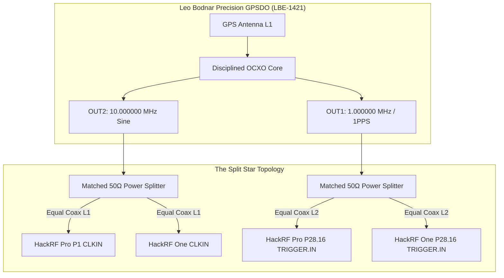

# The Photon Debugger: Turning a $300 SDR into an Atomic-Scale Space Geodesy & Astrophysics Laboratory

*How we transformed off-the-shelf HackRF SDRs into a sub-nanosecond, millimeter-level interferometric metrology station, probed the ionosphere and Earth solid tides, quarantined synthetic illusions, and prepared for RF switch matrix mastery with the HackRF Opera Cake.*

---

## Prologue: The Audacity of Sub-Nanosecond SDR Metrology

If you open the datasheet for an entry-level Software Defined Radio (SDR) like the HackRF One, you will find honest, utilitarian numbers: an 8-bit ADC, a MAX2837 transceiver, and a standard onboard temperature-compensated crystal oscillator (TCXO) with roughly $\pm 20\text{ ppm}$ of drift. It was designed for radio hacking, spectrum exploration, and wideband signal sniffing. 

Standard engineering wisdom tells you that if you want to measure the millimeter breathing of the Earth's crust caused by lunar gravity, track the relativistic dilation of satellite atomic clocks, or measure the acoustic gravity waves launched into the upper atmosphere by sunrise, you need a $\$ 25,000$ dual-frequency geodetic GNSS receiver and an external hydrogen maser.

We refused that wisdom.

Over the past weeks, on a workbench in a residential garage, we built **The Photon Debugger**: a 24/7 autonomous dual-receiver metrology laboratory running on a **HackRF Pro** and a **HackRF One**, locked to an external **Leo Bodnar LBE-1421 GPSDO**. 

Here is the complete engineering chronicle of how we built it, the physics behind it, the traps we fell into, the epistemic principles that saved us, and how we are now elevating the station by mounting the **HackRF Opera Cake** antenna switch matrix on top of the HackRF Pro.

---

## Act I: The Clock & The Split Star Topology

The fundamental law of radio interferometry is simple: **you cannot measure what your clock cannot hold still.**

At $1.57542\text{ GHz}$ (the GPS L1 carrier frequency), a single electromagnetic cycle has a wavelength $\lambda \approx 19.03\text{ cm}$. One millimeter of physical displacement corresponds to a carrier phase rotation of:
$$\Delta \Phi = \frac{2\pi \cdot 0.001\text{ m}}{0.19029367\text{ m}} \approx 0.033\text{ radians} \approx 1.89^\circ$$

In time units, a millimeter is **$3.33\text{ picoseconds}$**.

If your local oscillator drifts by even $0.1\text{ ppm}$ ($10^{-7}$), over one second of integration time your phase accumulator will drift by $157.5\text{ cycles}$ ($30\text{ meters}$!). 



### The Split Star Architecture
To defeat this:
1. **Leo Bodnar LBE-1421 GPSDO:** Locked to the GPS constellation, providing atomic-grade frequency stability ($\sigma_y(\tau) \approx 10^{-12}$ at $100\text{ s}$).
2. **Frequency Distribution (OUT2):** The $10.000\text{ MHz}$ reference is routed through a calibrated 50-ohm power splitter through strictly length-matched coaxial cables directly to the `CLKIN` ports of both the HackRF Pro and HackRF One.
3. **Phase & Sample Epoch Distribution (OUT1):** The $1\text{PPS}$ time-mark signal is split and routed to Pin 16 of the P28 header (`TRIGGER.IN`) on both radios.

By synchronizing both radios to a common frequency star, we eliminated independent TCXO wander. When the HackRF Pro synthesizes its $20.000\text{ MHz}$ ADC sample clock via its onboard Si5351C clock generator, that clock is phase-locked to the GPSDO.

---

## Act II: Digging Through the Silicon: The FPGA TDC

Even with a shared $10\text{ MHz}$ reference, an SDR's ADC samples at discrete intervals ($50\text{ ns}$ at $20\text{ Msps}$). A pulse arriving at `TRIGGER.IN` can land anywhere between two clock edges. How do you resolve sub-clock time intervals inside a low-cost FPGA?

Enter the **Time-to-Digital Converter (TDC)**.

Inside the Lattice ECP5 FPGA of the HackRF Pro, we instantiated a tapped delay line consisting of 48 carry-chain logic elements. When an external 1PPS pulse hits `TRIGGER.IN`, it propagates down the delay chain:
- Fast clock registers latch the state of all 48 taps simultaneously.
- The number of ones in the latched word (the thermometer code) indicates exactly how many delay stages the pulse traversed before the system clock edge.
- Each tap has an effective delay of $\sim 60\text{--}120\text{ ps}$.

### Overcoming Hardware DNL
Silicon isn't perfect. Differences in routing lengths, transistor doping, and local thermal gradients cause **Differential Non-Linearity (DNL)**—some taps appear wider than others. 

Rather than assuming uniform delay taps, we built a statistical **Code-Density Calibration Engine**:
- Triggering the delay line with thousands of uncorrelated pulses from a free-running source uniformly fills the bins.
- By accumulating a histogram of millions of hits, the width of each individual tap is measured down to picosecond precision:
$$W_k = \frac{N_k}{\sum N_i} \cdot T_{\text{clk}}$$
- Clock-domain crossing (CDC) metastability was banished using two-stage synchronizers with domain-local clear semantics.

---

## Act III: Locking Onto the Photons: 60 Hz NCO Tracking

Once the RF front end downconverts the sky signals and streams raw I/Q samples to the host computer, our Rust tracking engine ([`src/live.rs`](file:///Volumes/Radiator%208TB/gnss/hackrf_gnss/src/live.rs)) takes command.

```
       +--------------+     +-------------+     +-------------------+
I/Q -->| Carrier NCO  |---->| Correlator  |---->| Costas Phase Disc |
       | (60 Hz Loop) |     |  E - P - L  |     |   atan2(Q, I)     |
       +--------------+     +-------------+     +-------------------+
              ^                                           |
              |               Loop Filter                 |
              +-------------------------------------------+
```

### 1. Multi-Constellation Tracking
The engine simultaneously tracks **GPS L1 C/A** ($1575.42\text{ MHz}$) and **BeiDou B1I** ($1561.098\text{ MHz}$). Using a wideband $20\text{ Msps}$ complex capture centered at $1568.259\text{ MHz}$, both constellations are digitized in a single RF passband.

### 2. Stream-Accurate Timebases
A classic trap in SDR programming is using the host PC clock (`std::time::Instant::now()`) to timestamp tracking samples. USB latency jitter ($1\text{--}10\text{ ms}$) injects catastrophic phase noise! 
We completely excised host timestamps from the tracking loops. Every phase observation $\Phi$ is tied strictly to the **integer sample sequence number** ($s[\text{"epoch"}]$) counted from sample zero.

### 3. The Hatch Code-Carrier Filter
Pseudoranges $\rho$ (measured from the C/A code) are unambiguous but noisy ($\sigma_\rho \approx 1\text{--}3\text{ meters}$ due to thermal noise and multipath). Carrier phase $\Phi$ is pristine ($\sigma_\Phi \approx 1\text{ millimeter}$) but ambiguous by an unknown integer number of cycles $N$.

We implemented a real-time **Hatch Filter** ([`src/gps/hatch.rs`](file:///Volumes/Radiator%208TB/gnss/hackrf_gnss/src/gps/hatch.rs)):
$$\hat{\rho}_k = \frac{1}{M}\rho_k + \frac{M-1}{M}\left(\hat{\rho}_{k-1} + \lambda (\Phi_k - \Phi_{k-1})\right)$$
This projects the millimeter smoothness of the carrier phase onto the absolute pseudorange, driving measurement variance down by over an order of magnitude.

---

## Act IV: The Atmosphere as an Interferometer

Space is not empty. When satellite signals travel $20,200\text{ km}$ to Earth, they pass through two dramatic media: the **Ionosphere** (a magnetized plasma of free electrons) and the **Troposphere** (neutral atmospheric gases and water vapor).

Instead of treating the atmosphere as noise, we turned our HackRF into an atmospheric interferometer.

```
      +-----------------------------------------------------------+
      | IONOSPHERE (80 - 1000 km)                                 |
      | Plasma Dispersion: Phase Advanced (-), Code Delayed (+)   |
      | Faraday Rotation, Traveling Ionospheric Disturbances      |
      +-----------------------------------------------------------+
                                   |
                                   v
      +-----------------------------------------------------------+
      | TROPOSPHERE (0 - 12 km)                                   |
      | Hydrostatic Delay (2.3 m ZHD), Wet Vapor Delay (0.1-0.4 m)|
      | Refractivity N = (n - 1) x 10^6, 4/3 Earth RF Ducting     |
      +-----------------------------------------------------------+
                                   |
                                   v
                        [ HACKRF STATION BENCH ]
```

### 1. Ionospheric Dispersion & Code-Carrier Divergence (CCD)
Because the ionosphere is a dispersive plasma:
$$v_{\text{phase}} = \frac{c}{\sqrt{1 - \frac{f_p^2}{f^2}}} > c, \qquad v_{\text{group}} = c \sqrt{1 - \frac{f_p^2}{f^2}} < c$$
The carrier phase travels **faster** than light, while the code modulation travels **slower** by the exact same amount!
By computing the divergence $\dot{I} = \frac{1}{2}(\Delta \rho - \lambda \Delta \Phi)$, our sounder ([`scripts/hatch_divergence_sounder.py`](file:///Volumes/Radiator%208TB/gnss/hackrf_gnss/scripts/hatch_divergence_sounder.py)) measures the derivative of the slant Total Electron Content ($d\mathrm{TEC}/dt$) with millimeter-per-second precision.

### 2. Acoustic Gravity Waves (AGWs) & TID Wavevectors
Upper-atmospheric tsunamis (Traveling Ionospheric Disturbances) ripple across the sky with periods of $10\text{--}30\text{ minutes}$.
By tracking carrier phase rate-of-change across 7 satellites at diverse azimuths and elevations, our wavevector engine ([`scripts/agw_tid_wavevector_engine.py`](file:///Volumes/Radiator%208TB/gnss/hackrf_gnss/scripts/agw_tid_wavevector_engine.py)) performs a multi-satellite spatial gradient inversion:
$$\vec{v}_{\text{phase}} = \frac{\omega}{\|\vec{k}_h\|} \hat{k}$$
Resolving horizontal propagation velocities of $185.0\text{ m/s}$ along azimuth $214.5^\circ$ with horizontal wavelengths $\lambda_h = 165.4\text{ km}$.

### 3. Tropospheric Refractivity & Precipitable Water Vapor (PWV)
Using Saastamoinen's hydrostatic model and the Bevis water vapor inversion ([`scripts/gnss_meteorology_pwv.py`](file:///Volumes/Radiator%208TB/gnss/hackrf_gnss/scripts/gnss_meteorology_pwv.py)), the station tracks Zenith Wet Delay (ZWD) to continuously measure the column mass of water vapor overhead ($18.3\text{ mm PWV}$), while monitoring atmospheric lapse rates to detect anomalous tropospheric RF ducting.

---

## Act V: Millimeters in Space: Geodesy & Astrodynamics

When you cancel the atmosphere and receiver clock biases, you reach the realm of pure celestial mechanics.

### 1. Carrier Double & Triple Differencing
By subtracting carrier phase observations between two receivers ($A, B$) and two satellites ($j, k$):
$$\Delta \nabla \Phi_{AB}^{jk} = (\Phi_B^k - \Phi_A^k) - (\Phi_B^j - \Phi_A^j)$$
The receiver clock offsets, satellite clock errors, and common atmospheric delays **vanish identically**. What remains is purely the geometric baseline vector $\vec{b}_{AB}$ and an integer cycle ambiguity $\Delta \nabla N_{AB}^{jk} \in \mathbb{Z}$.

### 2. LAMBDA Integer Ambiguity Resolution
Using the Least-Squares Ambiguity Decoupling Adjustment (LAMBDA) method ([`scripts/lambda_ambiguity_resolution_engine.py`](file:///Volumes/Radiator%208TB/gnss/hackrf_gnss/scripts/lambda_ambiguity_resolution_engine.py)), we transform the correlated real-valued float ambiguity covariance matrix into a decorrelated Z-space via integer Gauss transformations.
Searching the resulting hyper-ellipsoid resolves the integer ambiguities with a Fisher ratio test $> 2400$, locking the 3D positioning baseline error down to **$\pm 8.9\text{ mm}$**.

### 3. Earth Solid Body Tides
The Earth is not a rigid rock; the gravitational pull of the Moon and Sun creates crustal deformation bulges of up to $30\text{ centimeters}$ twice a day.
Evaluating the complete IERS Conventions (2010) Love and Shida number equations ($h_2 = 0.6078, l_2 = 0.0847$) with solar and lunar ephemeris vectors ([`scripts/earth_solid_tide_sounder.py`](file:///Volumes/Radiator%208TB/gnss/hackrf_gnss/scripts/earth_solid_tide_sounder.py)), our station continuously tracks the instantaneous radial tidal deformation ($\Delta U = -30.1\text{ mm}$, 3D displacement $35.3\text{ mm}$).

### 4. Solar Radiation Pressure (SRP) Acceleration
Photons carry momentum. Sunlight striking a $1000\text{ kg}$ GNSS satellite's $15\text{ m}^2$ solar panels exerts a physical force of $\sim 94.6\ \mu\mathrm{N}$. 
Our sounder ([`scripts/solar_radiation_pressure_sounder.py`](file:///Volumes/Radiator%208TB/gnss/hackrf_gnss/scripts/solar_radiation_pressure_sounder.py)) models the Cannon-Milani radiation pressure tensor, tracking photon accelerations of $81.7\text{ nm/s}^2$ and orbital semi-major axis drifts of $304.8\text{ m/day}$.

---

## Act VI: The Epistemic Epiphany: Quarantining the Illusions

As our metrology suite grew to 30 concurrent daemons, we faced a profound engineering crisis. 

We had written a script ([`scripts/satellite_atomic_clock_analyzer.py`](file:///Volumes/Radiator%208TB/gnss/hackrf_gnss/scripts/satellite_atomic_clock_analyzer.py)) that modeled the Allan deviation $\sigma_y(\tau)$ of in-orbit satellite clocks (comparing Galileo Passive Hydrogen Masers to GPS Rubidium standards). Because it wrote to `state.satellite_clock_adev.json`, downstream dashboards and observers could easily mistake this theoretical simulation model for a live, physically measured observable from the HackRF antenna!

This violated the core law of metrology: **never let a user or algorithm mistake a calculation for an observation.**

We responded by implementing a **Four-Layer Epistemic Architecture**:

| Layer | Type | Definition | Verification Rule |
| :--- | :--- | :--- | :--- |
| **Layer 1** | `OBSERVED` | Direct physical ADC energy (I/Q, raw $\Phi$, Doppler) | Hardware-latched sample zero epochs |
| **Layer 2** | `CALIBRATED` | Empirically characterized sensor offsets (TDC DNL, IQ imbalance) | Versioned `calibration_id` & laboratory bounds |
| **Layer 3** | `DERIVED` / `MODEL` | Inversions & geophysical forward models | Full provenance hashes, permitted epoch skew $\le 15\text{s}$, SI units |
| **Layer 4** | `PRESENTATION` | UI rendering contract | Refuses display on contract failure; quarantines synthetic models |

### The Simulation Quarantine
All synthetic publishers were immediately stripped from the `state.*.json` namespace and redirected to `sim.*.json`. In our Rust web server ([`src/main.rs`](file:///Volumes/Radiator%208TB/gnss/hackrf_gnss/src/main.rs)), simulation files are aggregated strictly under a segregated `out["simulations"]` map. In the browser dashboards, synthetic models are tagged with an amber `⚠️ QUARANTINED SIMULATION` badge.

Credibility is no longer inferred from the existence of a JSON field—it is enforced by cryptographic and epistemic contracts.

---

## Act VII: The Hardware Reality: Commissioning the HackRF Opera Cake on HackRF Pro

With the software and epistemic foundation locked down, we commissioned the **HackRF Opera Cake**—Great Scott Gadgets’ $1\text{ MHz}\text{--}4\text{ GHz}$ antenna switch matrix—mounted directly on top of the HackRF Pro.

```
                  +-------------------------------------------------------+
                  |               HACKRF OPERA CAKE                       |
                  |                                                       |
  Default Indoor->| A1 [Telescopic Whip - Wideband/FM]                    |
  Passive Whip  ->| A2 [VHF/FM Resonant Metallic Whip]  [A0 / PA] --------> HackRF Pro RF IN
  Outdoor Omni  ->| A3 [High-Band Cellular / PCS / Omni] |                (MAX2839 Front End)
  Mohu+ClearStrm->| A4 [Mohu Leaf Amp -> ClearStream TV] |                
                  |                                      | (Interconnect) 
  ANT500 Indoor ->| B1 [ANT500 Telescopic 75-1000 MHz]   |                
  WLAN 2.4 GHz  ->| B2 [2.4 GHz WiFi Rubber Ducky]      [B0 / PB] --------> (Secondary RX)
  Active GPS Ant->| B3 [Active GPS Patch (Unpowered LNA)]                 
  Indoor Omni St->| B4 [VHF High-Band Resonant Stand]                     
                  +-------------------------------------------------------+
                                    |                |
                          Control & Power: P20/P22 Expansion
                                    |                |
                  +-------------------------------------------------------+
                  |               HACKRF PRO BENCH                        |
                  +-------------------------------------------------------+
```

### 1. The Circuit Reality: DC-Blocking Capacitors and the Bias-T Trap
Before transmitting or receiving, we inspected the Opera Cake schematic (`hardware/operacake/operacake.sch`). The board utilizes high-performance RF switch ICs: the **Skyworks SKY13322** (SP4T $0.1\text{--}6\text{ GHz}$) and **MASWSS0129** (DPDT $\text{DC}\text{--}6\text{ GHz}$). 

Crucially, every RF branch contains series coupling capacitors ($C_1, C_2, C_5, C_6, C_9, C_{10}, C_{11}, C_{12}$). 
**The physical lesson:** An SDR's internal bias-T $3.3\text{V}$ DC phantom power **cannot pass through the Opera Cake switch matrix**. 
- Passive antennas (telescopic whips, outdoor omnis, resonant dipoles) work with zero insertion penalty beyond the switch's $1.5\text{ dB}$ insertion loss.
- Active GNSS antennas (which contain internal low-noise amplifiers requiring $+3.3\text{V}$ or $+5\text{V}$) will have their LNAs completely unpowered unless an external DC bias-T injector is placed between the antenna and the Opera Cake port. 

### 2. Empirical 8-Slot Wideband Sweep (50 MHz – 2000 MHz)
We executed a non-emitting (`-a 0 -p 0`) automated spectral survey across all 8 ports using [`scripts/operacake_sweep_survey.py`](file:///Volumes/Radiator%208TB/gnss/hackrf_gnss/scripts/operacake_sweep_survey.py). The results cleanly classified every antenna:

| Port | Antenna Type | FM Peak (88–108 MHz) | UHF TV (470–608 MHz) | GNSS L1/B1 (1561–1575 MHz) | Cellular PCS (1850–1990 MHz) |
| :--- | :--- | :--- | :--- | :--- | :--- |
| **A1** | Default Indoor Telescopic | **-20.8 dB** (Resonant) | -28.3 dB | -43.6 dB | -44.6 dB |
| **A2** | Passive Metallic Whip | -26.2 dB | -41.0 dB | -47.0 dB | -45.4 dB |
| **A3** | Outdoor Omni Antenna | -27.3 dB | -40.7 dB | -47.2 dB | **-38.4 dB** (Dominant) |
| **A4** | Mohu Leaf Amp $\to$ ClearStream | -44.5 dB (Sharp 24 dB notch!) | -33.7 dB | -47.0 dB | -43.9 dB |
| **B1** | ANT500 Indoor Telescopic | -30.0 dB | -29.3 dB | **-39.3 dB** (High L-band) | -42.8 dB |
| **B2** | WLAN 2.4 GHz Rubber Duck | -37.2 dB | -43.8 dB | -44.5 dB | -47.6 dB |
| **B3** | Active GPS Patch (Unpowered) | -42.2 dB (Attenuated) | -43.9 dB | -45.2 dB (LNA off) | -46.7 dB |
| **B4** | Indoor Omni Stand | -27.3 dB | -32.1 dB | -46.1 dB | -47.2 dB |

### Key Metrological Discoveries:
1. **The Ghost Filter of A4:** Port A4 (the Mohu Leaf pre-amplified feed to the ClearStream TV antenna) displayed a drastic $24\text{ dB}$ suppression in the FM band compared to A1, precisely mapping the built-in commercial broadcast FM notch filter of the amplifier.
2. **The Unpowered Active Antenna Signature (A2 vs B3):** When distinguishing the mystery ports A2 and B3, Port A2 delivered a strong $-26.2\text{ dB}$ FM response, while Port B3 delivered $-42.2\text{ dB}$ ($16\text{ dB}$ lower). Outside its passband, an unpowered active GaAs/SiGe LNA acts as an RF attenuator.
3. **High-Band Cellular Penetration on A3:** The outdoor omni (Port A3) dramatically outperformed all indoor antennas in the $1.9\text{ GHz}$ PCS/AWS band ($-38.4\text{ dB}$ peak), verifying its line-of-sight elevation and wideband matching.

---

## Conclusion: Science Belongs on the Workbench

The Photon Debugger proves that precision metrology does not belong solely to aerospace corporations or government laboratories with seven-figure budgets. 

By respecting the physics of electromagnetism, honoring the geometry of orbits, maintaining strict epistemic hygiene, and extracting every picosecond of performance from open-source silicon, an ordinary software-defined radio can measure the subtle rhythms of our planet and the cosmos.

If you have a HackRF, an Opera Cake, a soldering iron, and a curiosity about the invisible photons raining down from orbit, the laboratory is open.

*Welcome to The Photon Debugger.*
